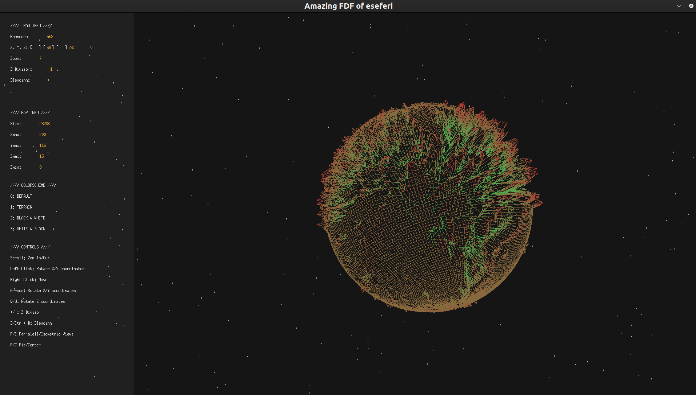
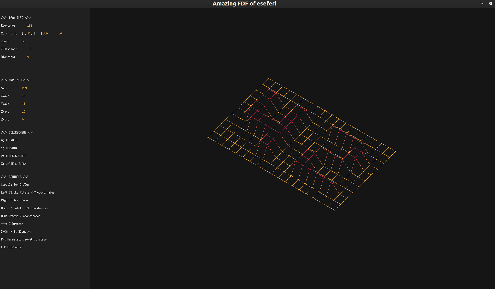
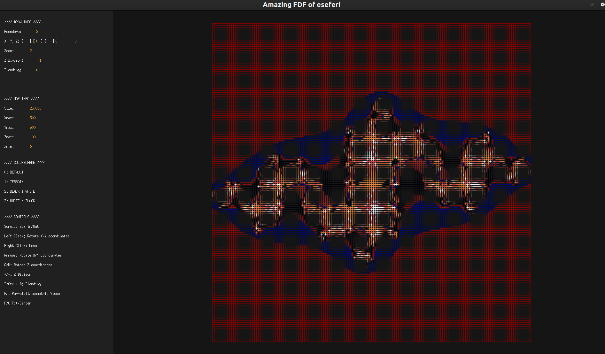
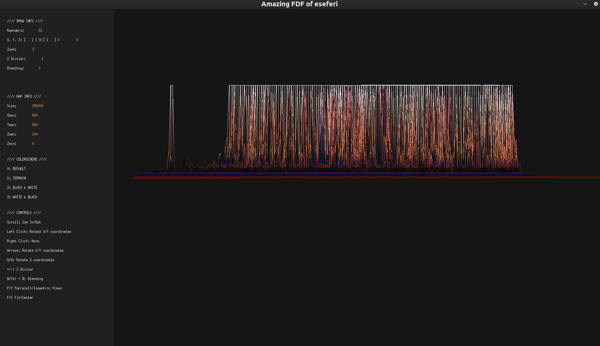

# FDF (Fil De Fer)

Welcome to FDF, a simple wireframe renderer developed in C using the mlx library.

## Graphic Programming and mlx

### What is Graphic Programming?

Graphic programming involves creating visual content using programming languages. It encompasses a wide range of techniques for displaying images, animations, and graphical user interfaces (GUIs) on screens. This can include anything from simple shapes and lines to complex 3D renderings.

### mlx Library

mlx (MiniLibX) is a simple X Windows graphic library created at 42 school. It provides a basic set of functions for creating graphical applications. mlx is particularly useful for projects involving simple 2D graphics, such as wireframe rendering, image manipulation, and basic GUI development.

### Features

1. Wireframe Rendering/ 
	Render 3D terrain as wireframe meshes. 
2. Support for Various Map Formats 
	Accept input files in various formats, allowing users to visualize different terrains.
3. Color Mapping 
	Map different colors to terrain heights, providing visual cues for elevation changes.
4. Dynamic Camera Control 
	Allow users to navigate the terrain dynamically using keyboard controls, providing a flexible viewing experience.
5. Zoom and Rotation 
	Enable users to zoom in/out and rotate the view to inspect the terrain from different angles.
6. Adjustable Altitude 
	Provide functionality to adjust the altitude of the terrain, allowing users to focus on specific areas.
7. Menu provided 
	There is a menu giving information for everything how to use it, and real time information.
8. Error Handling 
	Implement robust error handling mechanisms to gracefully handle invalid input files or unexpected errors.
9. Performance Optimization 
	Optimize rendering performance to ensure smooth visualization even for large-scale terrains.
10. Cross-Platform Compatibility
	Ensure compatibility with MacOs and Linux.
11. Modular Codebase 
	Structure the codebase in a modular fashion, making it easy to extend and maintain.
12. Documentation 
	Provide comprehensive documentation to guide users through installation, usage, and customization of the program.
13. Example Maps 
	Include a set of example maps to showcase the capabilities of the program and provide users with a starting point for exploration.
14. Integration with External Libraries
	Integrate with external libraries or APIs to extend functionality, in this case mlx library for mac and linux.
15. For more check the [subject](subject.pdf)

### Dependencies

1. MiniLibX (mlx_linux) Library 
	The mlx library is required for graphical rendering and user interface functionalities on Linux.

2. MiniLibX (mlx_mac) Library 
	The mlx library is required for graphical rendering and user interface functionalities on MacOS.

3. libft Library 
	The libft library provides various utility functions commonly used in C programming. It was developed as part of this project.

4. ft_printf Library 
	The ft_printf library is a custom implementation of the printf function for formatted output. It was developed as part of this project.

5. get_next_line Function 
	The get_next_line function is a custom function that reads a line from a file descriptor. It was developed as part of this project.

6. GNU Make 
	GNU Make is used to build the project from source code. It automates the compilation process using Makefiles. Make sure GNU Make is installed on your system.

### Getting Started

To get started with FDF, follow these steps:

1. Clone the repository to your local machine.
2. Compile the program using the provided Makefile.
3. Run the executable with the desired input file.

		git clone --recurse-submodules <repository-url>
		cd FDF
		make
		./fdf test_maps/<map file>

	We using git clone with submodules because im using the submodules I created from ft_printf and get_next_line

### Usage

1. Rotation 
	Rotate images using the left mouse button, arrow keys, W, and Q.

2. Moving 
	Move images using the right mouse button.

3. Zooming in/out 
	Control zooming by scrolling the middle mouse button.

4. Parallel Projection 
	Switch to parallel projection using the P key.

5. Isometric Projection 
	Switch to isometric projection using the I key.

6. Sphere Projection (Global Projection) 
	Switch to sphere projection using the G key. (Try map test_maps/march)

7. Starry Background in Global Projection 
	Add stars to the background in global projection using the S key.

8. Changing Colors 
	Change background or line colors using keys 1, 2, 3, and 4.

9. Removing/Rendering Lines 
	Toggle line rendering using the L key.

10. Removing/Rendering Dots 
	Toggle dot rendering using the D key.

### Examples

1. Spheric Projection

2. Izometric Projection

3. 2D projection

4. Parallel projection

### License

This project is licensed under the MIT License - see the LICENSE file for details.

Contact

If you have any questions, feedback, or suggestions regarding this project, feel free to reach out to me via:

- Email: [rk.seferi@gmail.com](mailto:rk.seferi@gmail.com)
- GitHub: [Vikingu-del](https://github.com/Vikingu-del)
- LinkedIn: [Erik Seferi](https://www.linkedin.com/in/erik-seferi-393438202/)

You can also open an issue on the project's GitHub repository for any bug reports or feature requests.